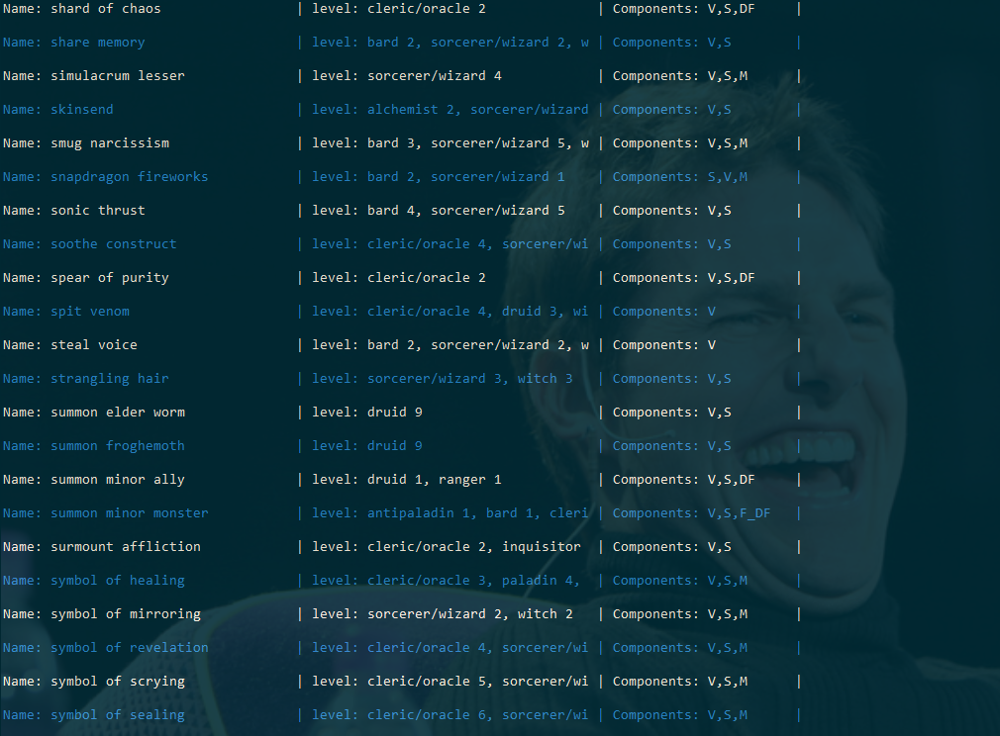
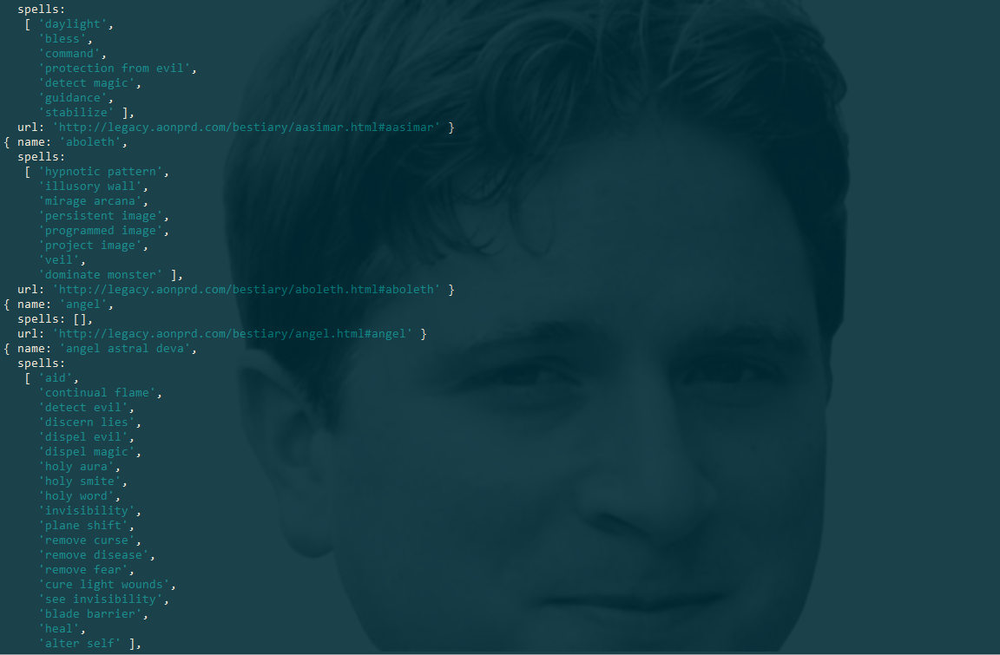
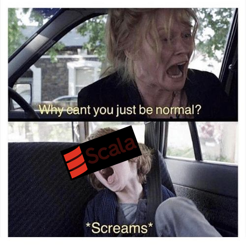
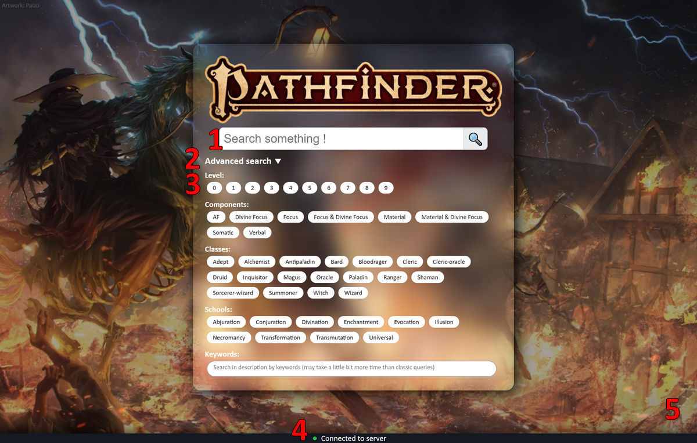
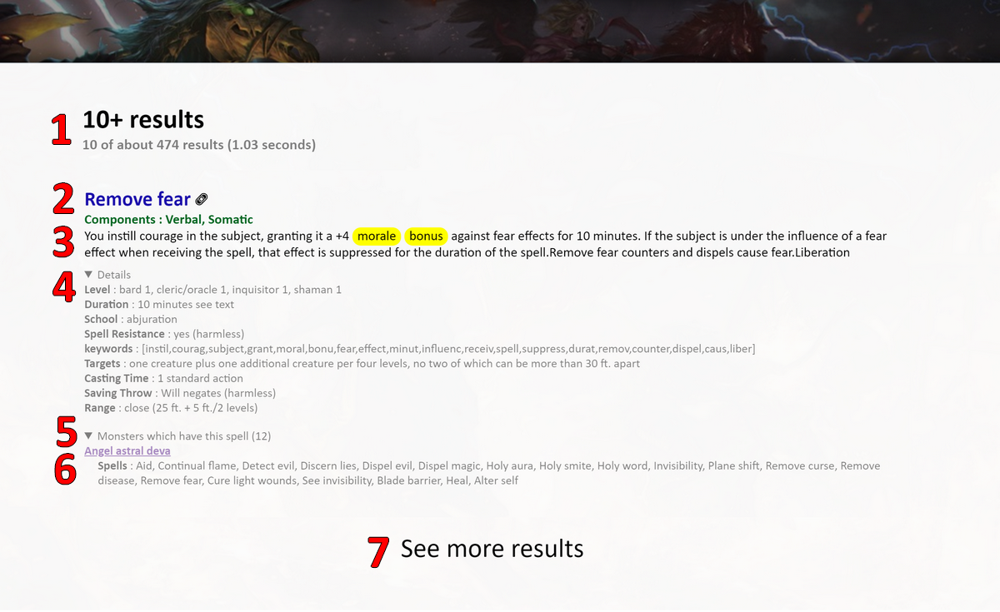

# TP n°2 Base de donnée reparties

Ce TP a été réalisé par Simon Lecoq et Louis-Quentin Joucla dans le cadre du cours 8INF803 de l'université du Québec à Chicoutimi (UQAC).

___

# Crawler

Le premier objectif de ce TP est de créer un crawler récupérant les données du JdR Pathfinder™. 
Le crawler a été réalisé sous NodeJS.

Comme pour le TP1, on va faire face à des sites très homogènes, ce sera donc un plaisir d'améliorer notre crawler.
Il n'y aura donc aucune utilité à gérer les [doubles](http://www.dxcontent.com/SDB_SpellBlock.asp?SDBID=925) [doublons](http://www.dxcontent.com/SDB_SpellBlock.asp?SDBID=1754), les [erreurs typographiques](http://www.dxcontent.com/SDB_SpellBlock.asp?SDBID=1701) dans les noms de classes, les [pages supprimées](http://www.dxcontent.com/SDB_SpellBlock.asp?SDBID=1841), ... En plus de devoir normaliser les noms de spells car on utilise deux sites, un pour les spells et un pour les monstres.

## Les spells

Pour construire les données de spells, nous avons mis à jour le [Prolocrawl™ v3.0](https://github.com/louisquentinjoucla/bddtp1), qui est passé à la version 7.0 ! Celui-ci inclus de nouvelles fonctionnalités, tels que la récupération automatisée d'urls informatiques, des caractéristiques et spécifités de chacun des spells, etc.

Voici par exemple le détail d'un spell généré par le Prolocrawl™ 7.0 :
```json
{
  "name": "alter self",
  "components": ["V", "S", "M"],
  "description": "When you cast this spell, you can assume the form of any Small or Medium creature of the humanoid type. If the form you assume has any of the following abilities, you gain the listed ability: darkvision 60 feet, low-light vision, scent, and swim 30 feet.Small creature: If the form you take is that of a Small humanoid, you gain a +2 size bonus to your Dexterity.Medium creature: If the form you take is that of a Medium humanoid, you gain a +2 size bonus to your Strength.",
  "keywords": ["cast", "spell", "assum", "form", "small", "medium", "creatur", "humanoid", "type", "follow", "abil", "gain", "list", "darkvis", "feet", "low", "light", "vision", "scent", "swim", "take", "size", "bonu", "dexter", "strength"],
  "url": "http://www.dxcontent.com/SDB_SpellBlock.asp?SDBID=7",
  "School": "transmutation (polymorph)",
  "Level": "bard 2, sorcerer/wizard 2, witch 2, summoner 2, alchemist 2, magus 2, shaman 2",
  "Casting Time": "1 standard action",
  "Range": "personal",
  "Targets": "you",
  "Duration": "1 min./level"
}
```
Les lecteurs aguéris remarqueront la présence d'un champ `"keywords"` (plus communément "clés-mots" en français).
Les ingénieurs de Prolocrawl™ 7.0 ont su copier des moteurs de recherches bancales dans le but de vous fournir, une experience utilisateur **très**.

### Etape 1: Supprimer les stopwords

Les stopswords sont les mots inutiles de langue anglaise sans lesquels il ne serait pas possible de former une phrase grammaticalement correcte.
Reprenons par exemple la description du spell ci-dessus auquel nous allons enlever les *stopwords*:

> *~~When you~~ cast ~~this~~ spell, ~~you can~~ assume ~~the~~ form ~~of any~~ Small ~~or~~ Medium creature ~~of the~~ humanoid type. ~~If the~~ form ~~you~~ assume ~~has any of the~~ following abilities, ~~you~~ gain ~~the~~ listed ability: darkvision ~~60~~ feet, low-light vision, scent, ~~and~~ swim ~~30~~ feet.Small creature: ~~If the~~ form ~~you~~ take ~~is that of a~~ Small humanoid, ~~you~~ gain ~~a +2~~ size bonus ~~to your~~ Dexterity. Medium creature: ~~If the~~ form ~~you~~ take ~~is that of a~~ Medium humanoid, ~~you~~ gain ~~a +2~~ size bonus ~~to your~~ Strength.*

On va ensuite normaliser le tout une nouvelle fois, en supprimant tous les caractères de ponctuation, les majuscules, etc.
Ce qui nous donne :

> *cast spell assume form small medium creature humanoid type form assume following abilities gain listed ability darkvision feet low light vision scent swim feet small creature form take small humanoid gain size bonus dexterity medium creature form take medium humanoid gain size bonus strength*

### Etape 2: Utiliser une bibliothèque trouvée sur le net pour obtenir les stemmers

Au delà de la recherche google épuisante, cela consiste à prendre uniquement la racine des mots, pour grouper les mots clés. Par exemple si on a:

> *loves love loving*

On obtient:

> *lov lov lov*

Si on l'applique à notre exemple de description, on obtient:

> *cast spell assum form small medium creatur humanoid type form assum follow abil gain list abil darkvis feet low light vision scent swim feet small creatur form take small humanoid gain size bonu dexter medium creatur form take medium humanoid gain size bonu strength*

Après avoir retiré les doublons, on obtient finalement le champ `"keywords"` tant convoité :

> *cast spell assum form small medium creatur humanoid type follow abil gain list darkvis feet low light vision scent swim take size bonu dexter strength*

### Etape 3: ???

Laissez la magie de Prolocrawl™ 7.0 opérer.

### Etape 4: Profit



## Les monstres

Pour construire notre fabuleux bestiaire, nous avons parcouru les tréfonds de legacy.aonprd.com ([on remercie la communauté de l'avoir ramené à la vie](https://paizo.com/community/blog/v5748dyo6sg93?Big-PathfinderStarfinder-Reference-Document-News)) avec notre crawler pour obtenir des objets JSON contenant entre autre le nom, les sorts et l'url de chaque monstre.

Voici un exemple de monstre :
```json
{
  "name": "kelpie",
  "spells": [
      "beast shape iv",
      "alter self"
  ],
  "url": "http://legacy.aonprd.com/bestiary2/kelpie.html#kelpie"
}
```




Wow ! Nous venons enfin de finir la première question de l'introduction du devoir 2. En même temps, avec un enoncé de 26 pages...

# Exercice 1

Qu'on le veuille ou non, on va devoir utiliser Apache spark, et donc le scala (la légende raconte même que certains auraient réussi à installer pyspark sur leur machine, mais apparemment nous ne sommes pas les élus...). Le but de cet exercice est de créer un moteur de recherche pour les sorts du JdR Pathfinder™.



## La batch layer

Le but de cette section est de transformer nos données crawlées en batchviews afin de faire plus facilement et plus rapidement des requêtes par la suite.

| Type          | Nombre de batch |
| ----------    | --------------: |
| Nom (a-z)     | 26 + 1          | 
| Composante    | 8*              |
| Classe        | 130*            | 
| Niveau        | 10*             |
| Ecole         | 10*             |
| Mot-clés      | 1               |
| Index inversé | 1               |

*Ceci est le nombre actuel de batchs views générés par notre application. Celle-ci étant bien conçue et bien pensée, le nombre de batch views peut s'adapter automatiquement en fonction des données trouvées par le Prolocrawl™ 7.0.

### [Creation des batchs views](https://github.com/louisquentinjoucla/bddtp2/blob/master/src/main/scala/Exercise1/BatchLayer.scala#L29-L177)

Nous avons à notre dispositions deux fichiers JSON (les données crawlées). Spark va transformer pour nous les deux fichiers JSON en RDD, sur lequels nous allons effectuer des opérations élémentaires tels que map, flatMap, filter, groupbykey, etc.
Prenons un premier exemple, nous voulons créer un index inversé des monstres. Nous avons des données de la forme:

| Monstre       | Spells                                          |
| ----------    | --------------                                  |
| Solar         | detect evil, heal, dictum, prismatic spray, etc.| 
| Planetar      | detect evil, heal, prismatic spray, etc.        |
| drake-rift    | slow                                            | 

On aura une fois l'index inversé créee: 

| Spell         | Monstres                                        |
| ----------    | --------------                                  |
| detect devil  | Solar, Planetar, etc.                           | 
| heal          | Solar, Planetar, etc.                           |
| slow          | drake-rift, etc.                                | 

Puis on sauvegardera ensuite la batchview en fichier texte, afin d'éviter de la recalculer à la prochaine exécution du serveur.
Voici le code correspondant pour générer cette batchview:

```scala
monsters.rdd
  .map(row => (row.getAs[String]("name"), row.getAs[Seq[String]]("spells")))
  .flatMap{case (monster, spells) => spells.map(spell => (spell, monster))}
  .groupByKey()
  .map{case (key, values) => (key, values.mkString("[", ";;", "]"))}
  .saveAsTextFile(s"src/resources/batchviews/spells/monsters")
```

Prenons un second exemple, cette fois-ci nous voulons créer des batch views comportant les spells par école. On aurait donc pour chaque école un fichier de ce type (par exemple necromancy):

| Spell           | School     |
| ----------      | ------     |
| eyebite         | necromancy | 
| false life      | necromancy |
| finger of death | necromancy | 
| gentle repose   | necromancy |

La première étape consiste à préparer les données des batchs views des school.
Une ligne du type `{name:"alter self", School:"transmutation (polymorph)"}` sera transformé en un tuple `(transmutation, alter self)`.
Une fois cette transformation effectuée sur chaque sort, on les regroupes par école.

```scala
//Préparation des batch views school (school, [...spell_name])
val spells_schools = spells.rdd
  .map(row => (row.getAs[String]("School").split(" ")(0).toLowerCase, row.getAs[String]("name")))
  .groupByKey()
```

Ensuite on va récolter ce nouveau rdd en tant que `Map[School -> List[Spells]]` et pour chaque clé du tableau (qui est une école), on va générer une nouvelle batchview contenant la liste des spells.

```scala
//Création des batch views school (spell_name, [school])
spells_schools.collectAsMap().keys.foreach{case school => {
  spells_schools
    .filter{case (key, values) => key == school}
    .flatMap{case (key, spells) => spells.map(spell => (spell, school))}
    .map{case (spell, school) => (spell, s"[${school}]")}
    .saveAsTextFile(s"src/resources/batchviews/spells/schools/${school}")
}}
```

L'ensemble des batchs views générées sont consultables dans le dossier [batchviews/spells](https://github.com/louisquentinjoucla/bddtp2/tree/master/src/resources/batchviews/spells)


## La serving layer

Cette couche va traiter les requêtes (transportées via des WebSockets) en utilisant les batch views. Cela va permettre de renvoyer efficacement une réponse à l'utilisateur.
Au lancement du serveur, celui-ci va charger les batchviews en mémoire et attendre les futures requêtes. 

Les requêtes sont reçues au format json et ressemblent à ceci:
```js
{
  name:"my spell", //Filtre par nom
  advanced:false, //Indique s'il s'agit d'une requête "avancée"
  levels:[], //Filtres de niveaux
  components:[], //Filtres de composantes
  classes:[], //Filtres de classes
  schools:[], //Filtres d'école
  misc:"", //Filtre de description
  limit:10 //Nombre de résultats à afficher
}
```

### [Traitement des requêtes](https://github.com/louisquentinjoucla/bddtp2/blob/cd82c235c1f6d41fe5f0efdaf49355789905db34/src/main/scala/Exercise1/ServingLayer.scala#L23-L139)

Tout d'abord on prendra le champ `name`, vu que pour celui-ci on a decoupé les batchs views selon les lettres de l'alphabet, on va selectionner la batch view qui correspond à la première lettre de la valeur associé à ce champ. Si le champ `name` n'est pas renseigné, nous avons une batch view regroupant toutes les spells. A noter que c'est uniquement dans ces batch views que l'on stock les informations des spells.

Pour chaque champ, on va récupérer les données de la batch view qui lui est associée (à condition que le filtre ne soit pas vide). 
Finalement, on fera une jointure entre les différentes batch view sélectionnées puis on retournera le résultat à l'interface utilisateur via la websocket.

## Interface utilisateur

### Recherche

L'interface utilisateur permet à l'utilisateur de selectionner facilement ses critères de recherche. En effet celui-ci peut faire des recherches par école, niveaux, classes, mots-clés, etc.
La plupart des moteurs de recherches similaires étant surchargés inutilement, nous avons préféré garder un design épuré.



1. Champ de recherche principal par nom de sort. 
2. Toggle pour afficher les options de recherches avancées (filtres)
3. Filtre par niveaux, composantes, classes, écoles et mots-clés.
4. Indicateur de connexion au serveur websockets
5. Background trop stylée avec des particules de feu flottantes

Les filtres agissent entre eux selon un opérateur logique ET, et les éléments au sein d'un filtre comme un OU.
Par exemple : `(Level 1 OU 2) ET (Composante V OU M)`

A chaque sélection d'un filtre ou d'une touche pressée, une requête est automatiquement envoyé au serveur, par souci d'ergonomie.

### Résultats

Les résultats des requêtes comportent toutes les caractéristiques nécessaires (notamment la liste des monstres qui ont ce sort) pour que l'utilisateur se fasse une idée des sorts, pour de plus amples informations, il peut être rediriger vers la page du sort en question.



1. Nombre de résultats affichés, nombre de résultats total trouvés et temps d'exécution de la requête
2. Nom du spell (+ 🔗 lien vers la fiche du spell)
3. Description du spell (si le filtre par description est actif, les mots-clés correspondant seront surlignés en jaune)
4. Details du spell (caché par défaut)
5. Monstres possédant ce spell (s'il y a lieu, caché par défaut)
6. Nom et détails du monstre (+ lien vers la fiche du monstre)
7. Afficher plus de résultats

### Disponible dès à présent sur tous appareils électronique possédant un navigateur digne de ce nom !

[Une version incroyable](https://api-scala.herokuapp.com/) est disponible pour effectuer vos futures recherches et préparer vos prochaines parties.


# Exercice 2
